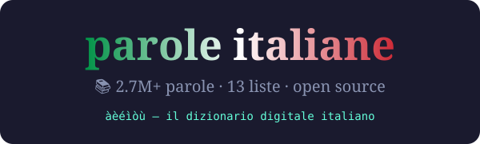

<p align="center">
  
</p>

<p align="center">
  <a href="LICENSE"></a>
  
  
  
</p>

---

Il più grande archivio open source di **parole italiane** su GitHub: oltre **2,7 milioni di voci** organizzate in 13 file di testo, pronte per l'uso in progetti software, ricerca linguistica e analisi dati.

## 📋 Contenuto

| File | Parole | Descrizione |
|------|-------:|-------------|
| `parole_uniche.txt` | 986.701 | **Tutte** le parole uniche del repository |
| `660000_parole_italiane.txt` | 661.563 | Ampio vocabolario italiano |
| `coniugazione_verbi.txt` | 334.953 | Coniugazioni complete di verbi italiani |
| `280000_parole_italiane.txt` | 279.894 | Vocabolario medio |
| `lista_cognomi.txt` | 175.240 | Cognomi italiani e stranieri |
| `110000_parole_italiane_con_nomi_propri.txt` | 116.878 | Parole + nomi propri e termini stranieri d'uso comune |
| `95000_parole_italiane_con_nomi_propri.txt` | 95.193 | Parole + nomi propri e località |
| `60000_parole_italiane.txt` | 60.454 | Vocabolario base |
| `lista_38000_cognomi.txt` | 38.487 | Cognomi italiani |
| `9000_nomi_propri.txt` | 8.913 | Nomi di persona |
| `1000_parole_italiane_comuni.txt` | 1.160 | Le parole più frequenti |
| `lista_badwords.txt` | 454 | Parolacce 🤬 (NSFW) |
| `400_parole_composte.txt` | 419 | Parole composte (es. baby-sitter) |

> In un archivio separato: `bruteforce.txt` con date di nascita, password comuni e combinazioni numeriche.

## 🚀 Casi d'uso

- **NLP e AI** — addestramento e valutazione di modelli linguistici italiani
- **Giochi** — wordle, cruciverba, anagrammi, scrabble
- **Correttori ortografici** — dizionari per spell-checker e autocomplete
- **Generazione dati** — test con nomi, cognomi e testo realistico in italiano
- **Sicurezza** — test di robustezza password (con `bruteforce.txt`)
- **Linguistica** — analisi morfologica, frequenza lessicale, coniugazioni

## 💾 Utilizzo rapido

Ogni file è un semplice elenco con **una parola per riga**, encoding **UTF-8**.

```bash
# Conta le parole
wc -l paroleitaliane/60000_parole_italiane.txt

# Cerca una parola
grep -i "ciao" paroleitaliane/parole_uniche.txt

# Parole che finiscono in -zione
grep -E "zione$" paroleitaliane/60000_parole_italiane.txt
```

```python
# Python
with open("paroleitaliane/parole_uniche.txt", encoding="utf-8") as f:
    parole = [line.strip() for line in f if line.strip()]

print(f"{len(parole)} parole caricate")
```

## 📂 Struttura

```text
paroleitaliane/
├── paroleitaliane/          # 📚 Tutti i file di parole (.txt)
│   ├── parole_uniche.txt
│   ├── 660000_parole_italiane.txt
│   ├── coniugazione_verbi.txt
│   └── ...
├── bruteforce/              # 🔐 File per test di sicurezza
├── CONTRIBUTING.md          # 🤝 Guida per contribuire
├── LICENSE                  # MIT
└── README.md
```

## 🤝 Come contribuire

Leggi [CONTRIBUTING.md](CONTRIBUTING.md) per le linee guida complete. In breve:

- **Correzioni**: accenti mancanti, errori ortografici
- **Aggiunte**: parole mancanti, nuovi file tematici (regionalismi, termini tecnici...)
- **Deduplicazione**: rimozione di duplicati tra i file
- **Documentazione**: miglioramenti a README e guide

## 📜 Licenza

[MIT](LICENSE) — usalo liberamente nei tuoi progetti.

---

<p align="center">
  <i>Creato con ❤️ in Italia</i>
</p>